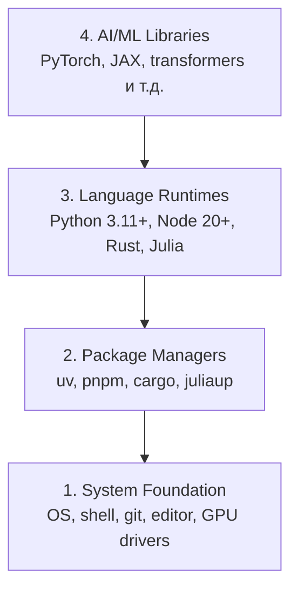

# Окружение разработки

> Твои инструменты формируют твое мышление. Настрой один раз и настрой правильно.

**Type:** Build
**Languages:** Python, Node.js, Rust
**Prerequisites:** None
**Time:** ~45 minutes

## Цели обучения

- Настроить toolchain для Python 3.11+, Node.js 20+ и Rust с нуля
- Настроить виртуальные окружения и менеджеры пакетов для воспроизводимых сборок
- Проверить доступ к GPU через CUDA/MPS и выполнить тестовую тензорную операцию
- Понять стек из четырех слоев: система, пакеты, рантаймы, AI-библиотеки

## Проблема

Ты собираешься изучать AI Engineering через 200+ уроков на Python, TypeScript, Rust и Julia. Если окружение сломано, каждый урок превращается в борьбу с инструментами вместо обучения.

Большинство людей пропускают настройку окружения. А потом тратят часы на отладку ошибок импортов, конфликтов версий и отсутствующих CUDA-драйверов. Мы сделаем это один раз и правильно.

## Концепция

Окружение для AI Engineering состоит из четырех слоев:



Мы устанавливаем снизу вверх. Каждый слой зависит от предыдущего.

## Build It

### Шаг 1: Системная база

Проверь систему и установи базовые инструменты.

```bash
# macOS
xcode-select --install
brew install git curl wget

# Ubuntu/Debian
sudo apt update && sudo apt install -y build-essential git curl wget

# Windows (используй WSL2)
wsl --install -d Ubuntu-24.04
```

### Шаг 2: Python с uv

Мы используем `uv` — он в 10-100 раз быстрее pip и автоматически управляет виртуальными окружениями.

```bash
curl -LsSf https://astral.sh/uv/install.sh | sh

uv python install 3.12

uv venv
source .venv/bin/activate  # или .venv\Scripts\activate в Windows

uv pip install numpy matplotlib jupyter
```

Проверка:

```python
import sys
print(f"Python {sys.version}")

import numpy as np
print(f"NumPy {np.__version__}")
a = np.array([1, 2, 3])
print(f"Vector: {a}, dot product with itself: {np.dot(a, a)}")
```

### Шаг 3: Node.js с pnpm

Для уроков на TypeScript (агенты, MCP-серверы, веб-приложения).

```bash
curl -fsSL https://fnm.vercel.app/install | bash
fnm install 22
fnm use 22

npm install -g pnpm

node -e "console.log('Node', process.version)"
```

### Шаг 4: Rust

Для уроков, критичных к производительности (инференс, системные части).

```bash
curl --proto '=https' --tlsv1.2 -sSf https://sh.rustup.rs | sh

rustc --version
cargo --version
```

### Шаг 5: Julia (опционально)

Для математически насыщенных уроков, где Julia особенно удобна.

```bash
curl -fsSL https://install.julialang.org | sh

julia -e 'println("Julia ", VERSION)'
```

### Шаг 6: Настройка GPU (если он есть)

```bash
# NVIDIA
nvidia-smi

# Установить PyTorch с CUDA
uv pip install torch torchvision torchaudio --index-url https://download.pytorch.org/whl/cu124
```

```python
import torch
print(f"CUDA available: {torch.cuda.is_available()}")
if torch.cuda.is_available():
    print(f"GPU: {torch.cuda.get_device_name(0)}")
```

Нет GPU? Не проблема. Большинство уроков работает на CPU. Для тяжелых тренировочных уроков используй Google Colab или облачные GPU.

### Шаг 7: Проверить всё

Запусти скрипт проверки:

```bash
python phases/00-setup-and-tooling/01-dev-environment/code/verify.py
```

## Use It

Твое окружение теперь готово для каждого урока этого курса. Вот где что используется:

| Language | Used In | Package Manager |
|----------|---------|-----------------|
| Python | Фазы 1-12 (ML, DL, NLP, Vision, Audio, LLMs) | uv |
| TypeScript | Фазы 13-17 (Tools, Agents, Swarms, Infra) | pnpm |
| Rust | Фазы 12, 15-17 (системы, критичные к производительности) | cargo |
| Julia | Фаза 1 (математические основы) | Pkg |

## Ship It

Этот урок создает скрипт верификации, который любой может запустить для проверки своего окружения.

См. `outputs/prompt-env-check.md` для промпта, который помогает AI-ассистентам диагностировать проблемы окружения.

## Упражнения

1. Запусти скрипт проверки и исправь все сбои
2. Создай Python-виртуальное окружение для этого курса и установи PyTorch
3. Напиши "hello world" на всех четырех языках и запусти каждый
