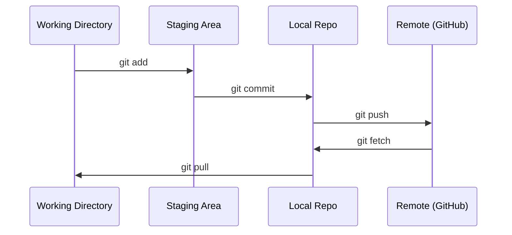

# Git и совместная работа

> Контроль версий не опционален. Каждый эксперимент, каждая модель и каждый урок должны отслеживаться.

**Type:** Learn
**Languages:** --
**Prerequisites:** Фаза 0, Урок 01
**Time:** ~30 минут

## Цели обучения

- Настроить git identity и использовать ежедневный цикл add, commit, push
- Создавать и сливать ветки для изолированных экспериментов без поломки main
- Написать `.gitignore`, исключающий чекпоинты и большие бинарные файлы
- Читать историю изменений через `git log` и понимать эволюцию проекта

## Проблема

Тебе предстоит написать сотни файлов кода в 20 фазах. Без контроля версий ты будешь терять работу, ломать проект без возможности отката и не сможешь нормально работать с другими.

Git - это инструмент. GitHub - место, где живет код. Этот урок покрывает ровно то, что нужно для курса.

## Концепция



Три вещи, которые нужно запомнить:
1. Сохраняй изменения часто (`git commit`)
2. Отправляй их в удаленный репозиторий (`git push`)
3. Для экспериментов работай в ветках (`git checkout -b experiment`)

## Build It

### Шаг 1: Настрой git

```bash
git config --global user.name "Your Name"
git config --global user.email "you@example.com"
```

### Шаг 2: Ежедневный workflow

```bash
git status
git add file.py
git commit -m "Add perceptron implementation"
git push origin main
```

### Шаг 3: Ветки для экспериментов

```bash
git checkout -b experiment/new-optimizer

# ... вносим изменения, коммитим ...

git checkout main
git merge experiment/new-optimizer
```

### Шаг 4: Работа с репозиторием курса

```bash
git clone https://github.com/rohitg00/ai-engineering-from-scratch.git
cd ai-engineering-from-scratch

git checkout -b my-progress
# проходи уроки, коммить свой код
git push origin my-progress
```

## Use It

Для этого курса достаточно этих команд:

| Command | Когда использовать |
|---------|--------------------|
| `git clone` | Забрать репозиторий курса |
| `git add` + `git commit` | Сохранить свою работу |
| `git push` | Сохранить на GitHub |
| `git checkout -b` | Экспериментировать, не ломая main |
| `git log --oneline` | Смотреть историю прогресса |

Этого достаточно. Для курса не нужны rebase, cherry-pick и submodules.

## Упражнения

1. Клонируй репозиторий, создай ветку `my-progress`, добавь файл, закоммить и отправь
2. Создай `.gitignore`, который исключает чекпоинты (`.pt`, `.pth`, `.safetensors`)
3. Посмотри историю репозитория через `git log --oneline` и изучи, как добавлялись уроки

## Ключевые термины

| Term | Как обычно говорят | Что это на самом деле |
|------|--------------------|------------------------|
| Commit | "Сохранение" | Снимок всего проекта в конкретный момент времени |
| Branch | "Копия" | Указатель на коммит, который двигается вперед по мере работы |
| Merge | "Объединение кода" | Перенос изменений из одной ветки в другую |
| Remote | "Облако" | Копия репозитория на внешнем сервере (GitHub, GitLab) |
