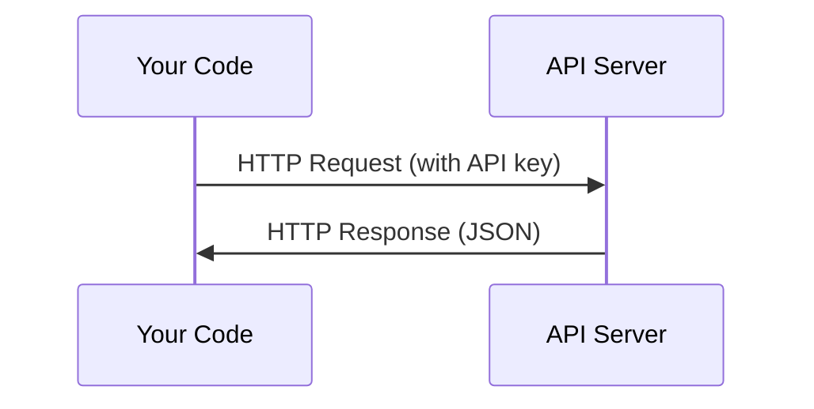

# API и ключи

> Любой AI API работает по одному шаблону: отправил запрос - получил ответ.

**Type:** Build
**Languages:** Python, TypeScript
**Prerequisites:** Фаза 0, Урок 01
**Time:** ~30 минут

## Цели обучения

- Безопасно хранить API-ключи через переменные окружения и `.env`
- Сделать вызов LLM API через Python SDK Anthropic и через raw HTTP
- Сравнить формат запросов/ответов SDK и raw HTTP для отладки
- Разобрать типичные ошибки API: авторизация, rate limits

## Проблема

Начиная с Фазы 11 ты будешь вызывать LLM API (Anthropic, OpenAI, Google). В Фазах 13-16 ты будешь строить агентные циклы на этих API. Нужно понимать, как работают ключи, как хранить их безопасно и как делать первый вызов.

## Концепция



Каждый API-вызов содержит:
1. Endpoint (URL)
2. API key (аутентификация)
3. Тело запроса (что ты хочешь)
4. Тело ответа (что ты получил)

## Build It

### Шаг 1: Храни ключи безопасно

Никогда не вставляй ключи прямо в код. Используй переменные окружения.

```bash
export ANTHROPIC_API_KEY="sk-ant-..."
export OPENAI_API_KEY="sk-..."
```

Или `.env` (добавь файл в `.gitignore`):

```text
ANTHROPIC_API_KEY=sk-ant-...
OPENAI_API_KEY=sk-...
```

### Шаг 2: Первый API-вызов (Python)

```python
import anthropic

client = anthropic.Anthropic()

response = client.messages.create(
    model="claude-sonnet-4-20250514",
    max_tokens=256,
    messages=[{"role": "user", "content": "What is a neural network in one sentence?"}]
)

print(response.content[0].text)
```

### Шаг 3: Первый API-вызов (TypeScript)

```typescript
import Anthropic from "@anthropic-ai/sdk";

const client = new Anthropic();

const response = await client.messages.create({
  model: "claude-sonnet-4-20250514",
  max_tokens: 256,
  messages: [{ role: "user", content: "What is a neural network in one sentence?" }],
});

console.log(response.content[0].text);
```

### Шаг 4: Raw HTTP (без SDK)

```python
import os
import urllib.request
import json

url = "https://api.anthropic.com/v1/messages"
headers = {
    "Content-Type": "application/json",
    "x-api-key": os.environ["ANTHROPIC_API_KEY"],
    "anthropic-version": "2023-06-01",
}
body = json.dumps({
    "model": "claude-sonnet-4-20250514",
    "max_tokens": 256,
    "messages": [{"role": "user", "content": "What is a neural network in one sentence?"}],
}).encode()

req = urllib.request.Request(url, data=body, headers=headers, method="POST")
with urllib.request.urlopen(req) as resp:
    result = json.loads(resp.read())
    print(result["content"][0]["text"])
```

Именно это SDK делают внутри. Понимание raw HTTP помогает при отладке.

## Use It

Для курса:

| API | Где понадобится | Free tier |
|-----|-----------------|-----------|
| Anthropic (Claude) | Фазы 11-16 (агенты, инструменты) | Обычно есть стартовый кредит |
| OpenAI | Фаза 11 (сравнение) | Обычно есть стартовый кредит |
| Hugging Face | Фазы 4-10 (модели, датасеты) | Free |

Не нужно поднимать все сразу. Настраивай по мере требований урока.

## Ship It

Этот урок создает:
- `outputs/prompt-api-troubleshooter.md` - диагностика частых ошибок API

## Упражнения

1. Получи ключ Anthropic и выполни первый API-вызов
2. Повтори через raw HTTP и сравни формат ответа с SDK
3. Специально подставь неверный ключ и изучи текст ошибки

## Ключевые термины

| Term | Как обычно говорят | Что это на самом деле |
|------|--------------------|------------------------|
| API key | "Пароль к API" | Уникальный ключ, который идентифицирует аккаунт и авторизует запрос |
| Rate limit | "Меня троттлят" | Ограничение количества запросов в минуту/час |
| Token | "Слово" (в API-контексте) | Единица биллинга: входные и выходные токены считаются отдельно |
| Streaming | "Ответ в реальном времени" | Получение ответа по частям, а не целиком в конце |
