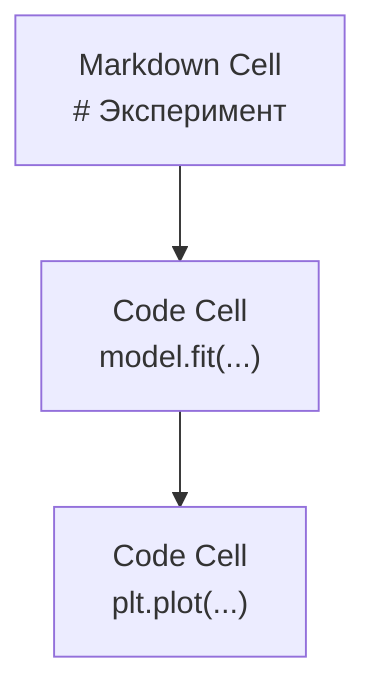
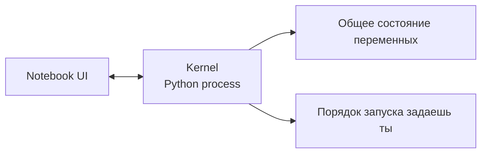

# Jupyter Notebooks

> Ноутбуки - лабораторный стол AI-инженера: быстро исследуешь, потом переносишь рабочее в продакшен-код.

**Type:** Build
**Languages:** Python
**Prerequisites:** Фаза 0, Урок 01
**Time:** ~30 минут

## Цели обучения

- Установить и запускать JupyterLab/Jupyter Notebook или VS Code с Jupyter-расширением
- Использовать magic-команды (`%timeit`, `%%time`, `%matplotlib inline`) для замеров и визуализации
- Понимать, когда выбирать ноутбук, а когда скрипт
- Избегать типичных ловушек: запуск в неправильном порядке, скрытое состояние, утечки памяти

## Проблема

Почти все туториалы, статьи и соревнования по AI используют Jupyter. Он позволяет выполнять код частями, сразу видеть вывод и быстро итерировать. Но если использовать ноутбук для всего подряд, отладка превращается в хаос.

## Концепция

Ноутбук - это список ячеек (code/markdown), которые выполняются одним общим kernel-процессом Python. Переменные сохраняются между ячейками.





## Build It

### Шаг 1: Выбери интерфейс

| Интерфейс | Установка | Лучше всего для |
|-----------|-----------|-----------------|
| JupyterLab | `pip install jupyterlab` + `jupyter lab` | Полноценная среда с вкладками |
| Jupyter Notebook | `pip install notebook` + `jupyter notebook` | Легкий классический режим |
| VS Code + Jupyter | Расширение Jupyter | Работа в одном редакторе с git/debug |

Все варианты работают с одним форматом `.ipynb`.

### Шаг 2: Горячие клавиши

Режимы:
- `Esc` - command mode
- `Enter` - edit mode

Часто используемые:
- `Shift+Enter` - выполнить ячейку и перейти к следующей
- `A` / `B` - вставить ячейку выше/ниже
- `DD` - удалить ячейку
- `M` / `Y` - markdown/code

### Шаг 3: Типы ячеек

Code ячейка:

```python
import numpy as np
data = np.random.randn(1000)
data.mean(), data.std()
```

Markdown ячейка: текст, формулы, таблицы, объяснения эксперимента.

### Шаг 4: Magic-команды

```python
%timeit np.random.randn(10000)
```

```python
%%time
model.fit(X_train, y_train, epochs=10)
```

```python
%matplotlib inline
```

```python
!pip install scikit-learn
```

### Шаг 5: Богатый вывод

```python
import pandas as pd

df = pd.DataFrame({
    "model": ["Linear", "Random Forest", "Neural Net"],
    "accuracy": [0.72, 0.89, 0.94]
})
df
```

```python
import matplotlib.pyplot as plt
plt.plot([1,2,3],[1,4,2])
plt.show()
```

### Шаг 6: Google Colab

1. Открой [colab.research.google.com](https://colab.research.google.com)
2. Загрузи `.ipynb`
3. Runtime > Change runtime type > T4 GPU

Особенности Colab: сессии могут завершаться, файлы лучше сохранять в Drive.

## Use It

| Для ноутбуков | Для скриптов |
|---------------|--------------|
| Исследование данных | Пайплайны обучения |
| Быстрый прототип | Переиспользуемые модули |
| Визуализация | Продакшен и расписание |
| Объяснение эксперимента | Все, что должно стабильно запускаться |

Правило: **исследуй в ноутбуках, поставляй в скриптах**.

## Частые ловушки

- Запуск ячеек не сверху вниз
- Скрытое состояние kernel
- Рост памяти из-за накопления объектов

Решение: периодически делать Restart & Run All.

## Ship It

Этот урок создает:
- `outputs/prompt-notebook-helper.md` для диагностики проблем с ноутбуками

## Упражнения

1. Сравни `%timeit` для list comprehension и numpy
2. Сделай ноутбук с markdown + кодом и проверь запуском Restart & Run All
3. Перенеси пример в Colab и запусти на бесплатном GPU

## Ключевые термины

| Term | Что это |
|------|---------|
| Kernel | Python-процесс, выполняющий ячейки и хранящий состояние |
| Cell | Отдельный блок кода или markdown |
| Magic command | Спецкоманды Jupyter с `%` или `%%` |
| `.ipynb` | JSON-файл ноутбука с ячейками и выводом |
