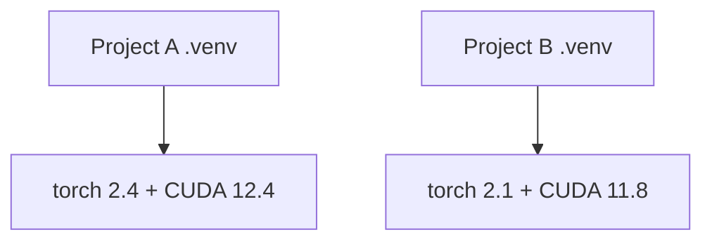

# Python-окружения

> Dependency hell существует. Виртуальные окружения - лекарство.

**Type:** Build
**Languages:** Shell
**Prerequisites:** Фаза 0, Урок 01
**Time:** ~30 минут

## Цели обучения

- Создавать изолированные окружения через `uv`, `venv`, `conda`
- Использовать `pyproject.toml`, optional dependencies и lockfiles
- Диагностировать типовые проблемы: global install, смешивание pip/conda, несовместимость CUDA
- Применять стратегию окружений по фазам курса

## Проблема

В AI-проектах зависимости конфликтуют постоянно: разные версии PyTorch/CUDA/библиотек. Глобальная установка ломает одни проекты ради других.

## Концепция

Каждому проекту - свое окружение и свои версии пакетов.



## Build It

### Вариант 1: uv (рекомендуется)

```bash
curl -LsSf https://astral.sh/uv/install.sh | sh
uv python install 3.12
cd your-project
uv venv
source .venv/bin/activate
uv pip install torch numpy
```

Инициализация проекта:

```bash
uv init my-ai-project
cd my-ai-project
uv add torch numpy matplotlib
```

### Вариант 2: venv

```bash
python3 -m venv .venv
source .venv/bin/activate
pip install torch numpy
```

### Вариант 3: conda

Используй, когда важны системные зависимости/CUDA toolkit:

```bash
conda create -n myproject python=3.12
conda activate myproject
conda install pytorch torchvision torchaudio pytorch-cuda=12.4 -c pytorch -c nvidia
```

Правило: в одном conda-окружении старайся ставить все через conda.

## Стратегия для курса

Не делай одно окружение на весь курс. Разные фазы могут требовать разные версии пакетов.

## pyproject.toml (база)

```toml
[project]
name = "ai-engineering-from-scratch"
version = "0.1.0"
requires-python = ">=3.11"
dependencies = [
    "numpy>=1.26",
    "matplotlib>=3.8",
    "jupyter>=1.0",
]

[project.optional-dependencies]
torch = ["torch>=2.3", "torchvision>=0.18"]
llm = ["anthropic>=0.39", "openai>=1.50"]
```

Установка групп:

```bash
uv pip install -e ".[torch]"
uv pip install -e ".[llm]"
uv pip install -e ".[torch,llm]"
```

## Lockfiles

Lockfile фиксирует точные версии всех зависимостей.

```bash
uv add numpy
uv pip compile pyproject.toml -o requirements.lock
uv pip install -r requirements.lock
```

## Частые ошибки

1. Глобальная установка вместо venv
2. Смешивание pip и conda без порядка
3. Запуск без активации окружения
4. Коммит `.venv` в git
5. Несовместимые версии CUDA (driver vs torch build)

## Use It

```bash
bash phases/00-setup-and-tooling/06-python-environments/code/env_setup.sh
```

## Упражнения

1. Запусти `env_setup.sh`
2. Создай второе окружение и установи другую версию `numpy`
3. Напиши `pyproject.toml` для проекта с PyTorch и Anthropic SDK
4. Специально сделай global install и проверь, куда встал пакет

## Ключевые термины

| Term | Что это |
|------|---------|
| Virtual environment | Изолированная папка с интерпретатором Python и пакетами |
| Lockfile | Полный список зависимостей с зафиксированными версиями |
| pyproject.toml | Стандартный конфиг Python-проекта |
| CUDA mismatch | Несовместимость версии CUDA в драйвере и сборке PyTorch |
