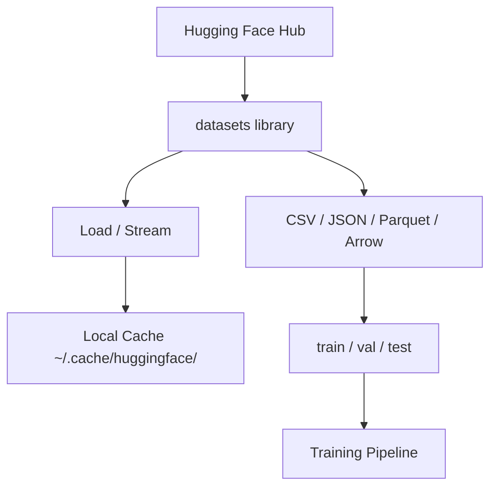

# Управление данными

> Данные - топливо. От того, как ты ими управляешь, зависит скорость всей разработки.

**Type:** Build
**Language:** Python
**Prerequisites:** Фаза 0, Урок 01
**Time:** ~45 минут

## Цели обучения

- Загружать, стримить и кэшировать датасеты через Hugging Face `datasets`
- Конвертировать CSV/JSON/Parquet/Arrow и понимать компромиссы
- Делать воспроизводимые train/val/test сплиты с фиксированным seed
- Управлять большими файлами моделей и данных через `.gitignore`, Git LFS или DVC

## Проблема

Любой AI-проект начинается с данных: найти, загрузить, преобразовать, разделить, версионировать. Ручной подход медленный и ненадежный.

## Концепция



## Build It

### Шаг 1: Установка

```bash
pip install datasets huggingface_hub
```

### Шаг 2: Загрузка датасета

```python
from datasets import load_dataset

dataset = load_dataset("imdb")
print(dataset)
print(dataset["train"][0])
```

### Шаг 3: Streaming больших датасетов

```python
dataset = load_dataset("wikimedia/wikipedia", "20220301.en", split="train", streaming=True)
for i, example in enumerate(dataset):
    print(example["title"])
    if i >= 4:
        break
```

### Шаг 4: Форматы данных

```python
dataset = load_dataset("imdb", split="train")
dataset.to_csv("imdb_train.csv")
dataset.to_json("imdb_train.json")
dataset.to_parquet("imdb_train.parquet")
```

| Format | Размер | Скорость чтения | Для чего |
|--------|--------|------------------|----------|
| CSV | Большой | Медленно | Читаемость, таблицы |
| JSON | Большой | Медленно | API, вложенные структуры |
| Parquet | Меньше | Быстро | Аналитика, хранение |
| Arrow | Малый | Самый быстрый | Внутренний формат в памяти |

### Шаг 5: Сплиты

```python
dataset = load_dataset("imdb", split="train")
split = dataset.train_test_split(test_size=0.2, seed=42)
train_val = split["train"].train_test_split(test_size=0.125, seed=42)

train_ds = train_val["train"]
val_ds = train_val["test"]
test_ds = split["test"]
```

### Шаг 6: Загрузка и кэш моделей

```python
from huggingface_hub import hf_hub_download, snapshot_download

cfg = hf_hub_download("sentence-transformers/all-MiniLM-L6-v2", "config.json")
model_dir = snapshot_download("sentence-transformers/all-MiniLM-L6-v2")
print(cfg, model_dir)
```

### Шаг 7: Большие файлы

`.gitignore` (базовый вариант):

```text
*.bin
*.safetensors
*.pt
*.onnx
data/*.parquet
data/*.csv
models/
```

Git LFS:

```bash
git lfs install
git lfs track "*.bin"
git lfs track "*.safetensors"
```

DVC:

```bash
pip install dvc
dvc init
dvc add data/training_set.parquet
```

## Use It

```bash
python code/data_utils.py
```

## Ship It

- `code/data_utils.py`
- `outputs/prompt-data-helper.md`

## Упражнения

1. Загрузи `glue` с конфигом `mrpc`
2. Постримь `c4` 10 секунд и посчитай, сколько примеров обработано
3. Сравни размер CSV и Parquet
4. Сделай сплит 70/15/15 с фиксированным seed

## Ключевые термины

| Term | Что это |
|------|---------|
| Streaming | Обработка по строкам без полной загрузки |
| Parquet | Колоночный формат хранения |
| Arrow | Быстрый in-memory формат |
| Git LFS | Хранение больших файлов вне git-объектов |
| DVC | Контроль версий для данных и моделей |
